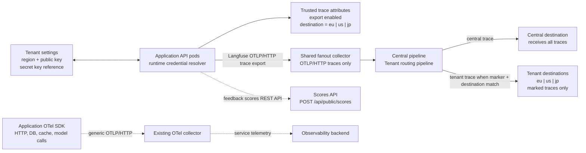
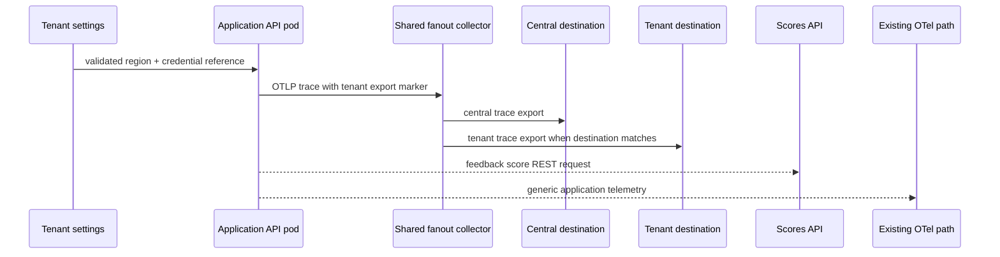

# Shareable Demultiplexing Example

Use this example when a diagram needs to show one producer sending a shared stream into a component that splits it into central, tenant, regional, or otherwise scoped destinations. The original pattern came from a Langfuse trace demultiplexing diagram: application traces go to a shared collector, central export receives every trace, tenant export receives only marked traces, feedback scores bypass the collector, and unrelated application telemetry stays on its existing path.

## What To Preserve

- Keep configuration, runtime producers, routing attributes, shared fanout infrastructure, and destinations as separate boxes.
- Show the always-on central path separately from filtered tenant or regional paths.
- Show routing markers near the component that creates them.
- Show direct API paths, such as feedback scores, separately from collector/exporter paths.
- Put unrelated telemetry in a visually lighter lane so it does not compete with the main demultiplexing story.
- Use destination keys such as `eu`, `us`, or `jp` precisely; do not call them tenant ids unless they are tenant ids.
- Label whether metadata is transport context, trace attributes, stored state, or outbound headers.

## Block Diagram Sketch

## Sequence Sketch

## Label Notes

- Say `tenant destination` or `destination key` for values like `eu`, `us`, and `jp`.
- Say `collector transport metadata` when a header is available to the collector but is not persisted as a trace field.
- Say `trusted trace attributes` only when the application actually creates the marker used for routing.
- Say `delete routing attrs before export` if the collector strips internal routing markers before forwarding.
